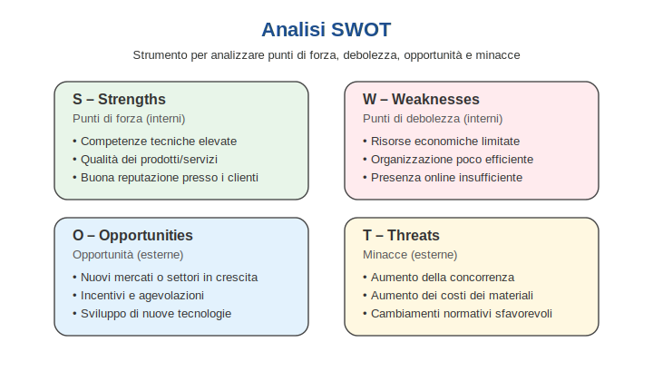
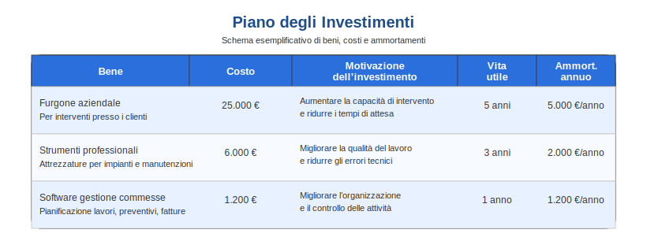

# 📊 Il Business Plan

## 1. Che cos'è?
Il Business Plan è il documento strategico che definisce il progetto imprenditoriale. 
Non è solo un "foglio di calcolo", ma il biglietto da visita dell'azienda verso banche e investitori per ottenere finanziamenti.

> **Definizione per l'Esame:** È un documento che sintetizza i contenuti e le caratteristiche di un progetto imprenditoriale, pianificandone le strategie e valutandone i risultati attesi nel medio periodo (3-5 anni).

---

## 2. L'Analisi SWOT (Strategia)
Prima di fare i calcoli, l'imprenditore usa la **Matrice SWOT** per incrociare i fattori Interni/Esterni con quelli Positivi/Negativi.

Ecco lo schema concettuale:

 

🔍 ESEMPIO BASE: Nuova Divisione "Fotovoltaico"

<h3 style="margin-top:0;">Scenario: Installazione Pannelli Solari</h3>

L'azienda vuole sfruttare il momento favorevole delle energie rinnovabili.

<table style="width: 100%; border-collapse: separate; border-spacing: 5px;">
<tr>
<td style="background-color: #d4edda; padding: 10px; border-radius: 5px; width: 50%; vertical-align: top;">
<strong>✅ STRENGTHS (Forza)</strong> 
Abbiamo elettricisti già certificati internamente.
</td>
<td style="background-color: #f8d7da; padding: 10px; border-radius: 5px; width: 50%; vertical-align: top;">
<strong>❌ WEAKNESSES (Debolezze)</strong> 
Non abbiamo furgoni attrezzati per i tetti.
</td>
</tr>
<tr>
<td style="background-color: #d1ecf1; padding: 10px; border-radius: 5px; vertical-align: top;">
<strong>🚀 OPPORTUNITIES (Opportunità)</strong> 
Il Governo ha lanciato il "Bonus Green".
</td>
<td style="background-color: #fff3cd; padding: 10px; border-radius: 5px; vertical-align: top;">
<strong>⚠️ THREATS (Minacce)</strong> 
Concorrenza aggressiva di aziende low-cost.
</td>
</tr>
</table>

 

<strong>🎯 Strategia Risultante</strong> 
Sfruttiamo i tecnici interni (S) per cogliere il Bonus (O), ma dobbiamo investire subito nei furgoni (W) per battere la concorrenza (T).

📈 ESEMPIO AVANZATO: Svolta Digitale (Domotica)

<h3 style="margin-top:0;">Scenario Complesso: Ingresso nel mercato "Smart Home"</h3>

L'azienda valuta se evolversi integrando l'elettronica con l'informatica (IoT). La situazione è rischiosa.

<table style="width: 100%; border-collapse: separate; border-spacing: 5px;">
<tr>
<td style="background-color: #d4edda; padding: 10px; border-radius: 5px; width: 50%; vertical-align: top;">
<strong>✅ STRENGTHS (Forza)</strong>
<ul style="margin: 5px 0 0 20px; padding: 0;">
<li>Brand storico e affidabile (25 anni).</li>
<li>Ottima liquidità finanziaria (soldi in cassa).</li>
<li>Clienti industriali molto fedeli.</li>
</ul>
</td>
<td style="background-color: #f8d7da; padding: 10px; border-radius: 5px; width: 50%; vertical-align: top;">
<strong>❌ WEAKNESSES (Debolezze)</strong>
<ul style="margin: 5px 0 0 20px; padding: 0;">
<li><strong>Mancanza di competenze informatiche/SW.</strong></li>
<li>Personale tecnico resistente al cambiamento.</li>
<li>Marketing digitale inesistente.</li>
</ul>
</td>
</tr>
<tr>
<td style="background-color: #d1ecf1; padding: 10px; border-radius: 5px; vertical-align: top;">
<strong>🚀 OPPORTUNITIES (Opportunità)</strong>
<ul style="margin: 5px 0 0 20px; padding: 0;">
<li>Fondi PNRR per la digitalizzazione 4.0.</li>
<li>Mercato Domotica in crescita (+30%).</li>
<li>Richiesta di impianti "intelligenti".</li>
</ul>
</td>
<td style="background-color: #fff3cd; padding: 10px; border-radius: 5px; vertical-align: top;">
<strong>⚠️ THREATS (Minacce)</strong>
<ul style="margin: 5px 0 0 20px; padding: 0;">
<li>Ingresso di colossi (Google, Amazon).</li>
<li>Normative Cybersecurity complesse.</li>
<li>Difficoltà a trovare programmatori.</li>
</ul>
</td>
</tr>
</table>

 

<strong>🤔 Analisi Strategica (Trade-off)</strong> 
Abbiamo i soldi (S) ma non le competenze (W). 
<strong>Decisione:</strong> Usiamo la liquidità (S) per <strong>acquisire una piccola startup informatica</strong> o fare una Joint Venture. Questo risolve la debolezza tecnologica (W) subito e ci permette di prendere i fondi PNRR (O) prima che i big player dominino il mercato (T).

---

## 3. La Struttura del Business Plan
Il documento completo si divide in **almeno** due parti.

### A) Parte Descrittiva (Qualitativa)
1.  **Executive Summary:** Sintesi per gli investitori.
2.  **L'Impresa:** Chi siamo (Storia, Soci, Organigramma).
3.  **Mercato:** Analisi dei clienti e concorrenti.
4.  **Marketing Mix:** Le 4P (Prodotto, Prezzo, Posto, Promozione).
5.  **Piano Operativo:** Risorse umane e tecnologie necessarie.

### B) Parte Economico-Finanziaria (Quantitativa)
Questa sezione traduce le idee in numeri.

#### 1. Piano degli Investimenti
Le spese di avvio necessarie (Start-up). Ecco un esempio grafico di come si calcolano i costi e gli ammortamenti:

 

#### 2. Il Bilancio Previsionale
Gli altri documenti fondamentali da conoscere sono:

* **[Conto Economico](https://it.wikipedia.org/wiki/Conto_economico "Clicca per leggere la definizione su Wikipedia"):** Ricavi previsti - Costi previsti = **Utile**.
* **[Break Even Point (B.E.P.)](https://it.wikipedia.org/wiki/Punto_di_pareggio "Clicca per leggere la definizione su Wikipedia"):** Il punto di pareggio, ovvero il momento esatto in cui i ricavi iniziano a superare i costi totali.
