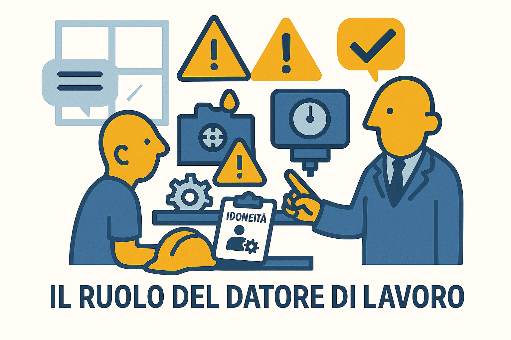

# 💼 Il Datore di Lavoro

?> **DEFINIZIONE (Art. 2):**
Il soggetto titolare del rapporto di lavoro con il lavoratore o, comunque, il soggetto che ha la responsabilità dell'organizzazione stessa o dell'unità produttiva in quanto esercita i poteri decisionali e di spesa.

---

### 📸 Il Ruolo in Sintesi

---

## 👑 Chi è? (Il Vertice)

È la figura apicale dell'azienda. Si distingue perché detiene due poteri fondamentali:
1.  **Potere Decisionale:** Decide le strategie e l'organizzazione aziendale.
2.  **Potere di Spesa:** Ha il "portafoglio" (budget) necessario per investire in sicurezza (acquistare macchinari sicuri, pagare la formazione, comprare i DPI).

---

## 📜 Obblighi "Non Delegabili" (Art. 17)

Il Datore ha molti obblighi, ma ce ne sono **DUE che NON può delegare a nessuno** (nemmeno ai Dirigenti):

1.  📝 **Valutare tutti i rischi** ed elaborare il **DVR** (Documento di Valutazione dei Rischi).
2.  👉 **Nominare l'RSPP** (Responsabile del Servizio di Prevenzione e Protezione).

> *Tutti gli altri obblighi (es. consegnare i DPI, organizzare le visite mediche) possono essere delegati, ma la responsabilità della Valutazione dei Rischi rimane sempre sua.*

---

## 🚫 Sanzioni

!> **ATTENZIONE:**
Poiché ha il massimo potere, ha anche la **massima responsabilità**.
Il mancato rispetto degli obblighi (es. non fare il DVR o farlo male) comporta sanzioni penali (**Arresto** o Ammenda) e, nei casi più gravi, la sospensione dell'attività imprenditoriale.

 
 

---
[🔙 Torna all'Organigramma](ud4.md)
