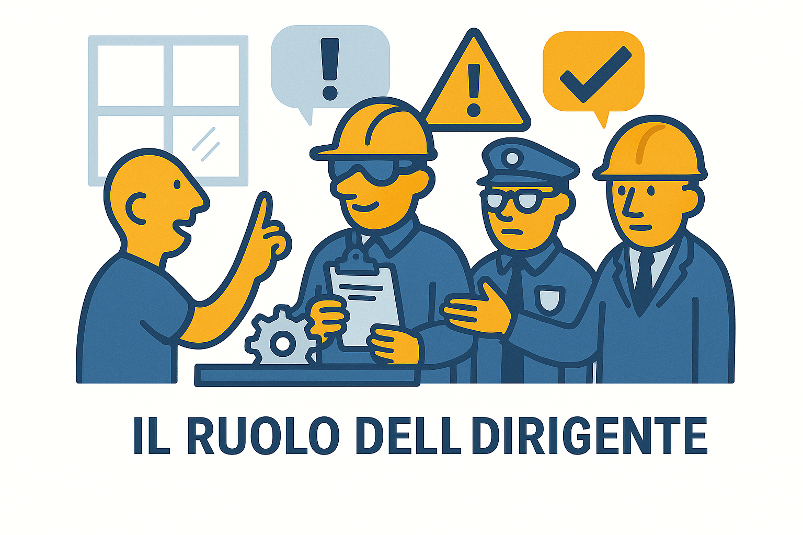

# 👔 Il Dirigente

?> **DEFINIZIONE (Art. 2):**
Persona che attua le direttive del datore di lavoro organizzando l'attività lavorativa e vigilando su di essa.

---

### 📸 Il Ruolo in Sintesi

---

## 🧠 Compiti e Organizzazione

Il Dirigente è considerato l'**alter ego** (o il "braccio destro") del Datore di Lavoro. Mentre il Datore decide "cosa" fare (la strategia), il Dirigente decide **"come"** farlo.

I suoi compiti principali sono:

* **🛠️ Organizzare il lavoro:** Definisce i turni, le procedure tecniche e i flussi produttivi.
* **⚙️ Gestire i mezzi:** Decide quali attrezzature usare e si assicura che siano conformi.
* **📉 Attuare le direttive:** Trasforma le decisioni del vertice in azioni concrete in reparto.
* **👁️ Vigilare:** Controlla che le misure di sicurezza siano rispettate (su un livello organizzativo più alto rispetto al Preposto).

---

## ⚖️ Responsabilità

!> **ATTENZIONE:**
Il Dirigente ha **responsabilità penali** (Arresto o Ammenda) speculari a quelle del Datore di Lavoro.
Se organizza un lavoro ignorando le norme di sicurezza o non fornendo i mezzi adeguati, risponde personalmente dell'eventuale infortunio.

 
 

---
[🔙 Torna all'Organigramma](ud4.md)
