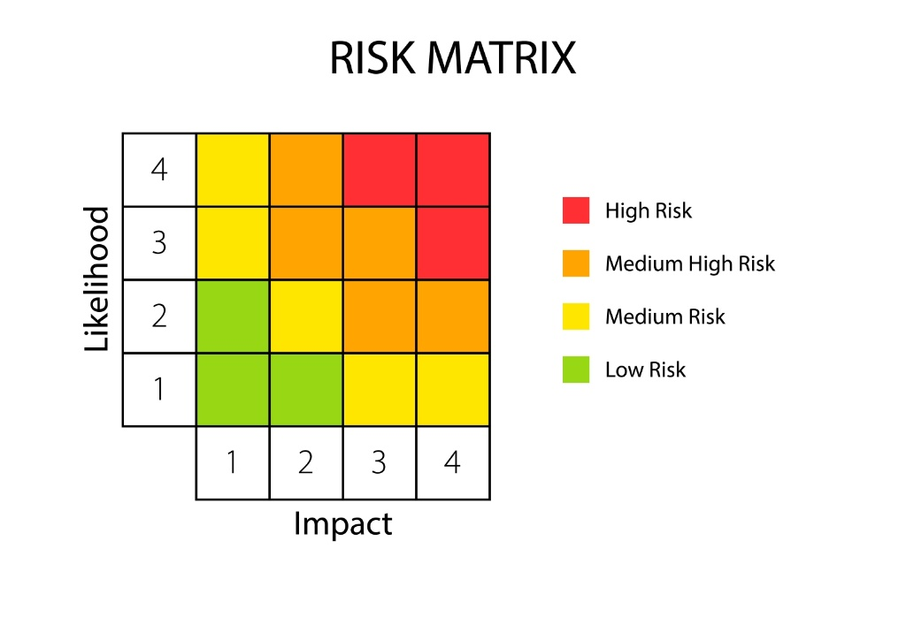

# ⚠️ D.V.R. (Documento Valutazione Rischi)

Il DVR è il documento **più importante** per la sicurezza. Non è un semplice pezzo di carta, ma la "fotografia dinamica" della sicurezza in azienda.

---

## 1. Il Metodo di Valutazione (R = P × D)
Per valutare un rischio non si va "a sensazione". La legge impone un metodo scientifico basato su una formula precisa:

> ### **R = P × D**

Dove:
* **P = Probabilità:** Quanto è probabile che l'evento accada? (Scala 1-4).
* **D = Danno:** Se l'evento accade, quanto male ci si fa? (Scala 1-4).
* **R = Rischio:** Il numero finale che indica l'urgenza dell'intervento.

### 🔢 La Matrice del Rischio
Ecco la visualizzazione grafica che incrocia Probabilità e Danno:

 

> **Legenda Colori:**
> * ■ **Verde (Basso):** Rischio accettabile. Nessuna azione immediata.
> * ■ **Giallo (Medio):** Rischio da monitorare. Programmare miglioramenti.
> * ■ **Arancione (Medio-Alto):** Intervento correttivo necessario a breve termine.
> * ■ **Rosso (Alto):** Pericolo grave. **Sospendere l'attività** o intervenire subito.

---

## 2. Le Misure di Prevenzione e Protezione
Una volta calcolato il rischio (**R**), il Datore di Lavoro deve intervenire per abbassarlo.

1.  **Prevenzione:** Azioni per abbassare la **Probabilità** (es. formazione, manutenzione macchine).
2.  **Protezione:** Azioni per abbassare il **Danno** (es. uso dei DPI come caschi e scarpe, barriere fisiche).

---

## 3. Dati Generali del Documento

* **Chi lo redige?**
    * Il **Datore di Lavoro** (obbligo *non delegabile*).
    * Collaborazione obbligatoria: **RSPP** e **Medico Competente**.
    * Consultazione obbligatoria: **RLS**.
* **Quando si fa?**
    * Entro **90 giorni** dall'apertura della nuova attività.
    * Va aggiornato **immediatamente** se:
        * Cambia il processo produttivo.
        * Cambia l'organizzazione del lavoro.
        * Avvengono infortuni significativi o la sorveglianza sanitaria ne evidenzia la necessità.
* **Data Certa:**
    Il documento deve avere "Data Certa" (es. PEC, firma digitale) per dimostre legalmente che è stato fatto *prima* di un eventuale infortunio.

[🔙 Torna all'Organigramma](ud4.md)
