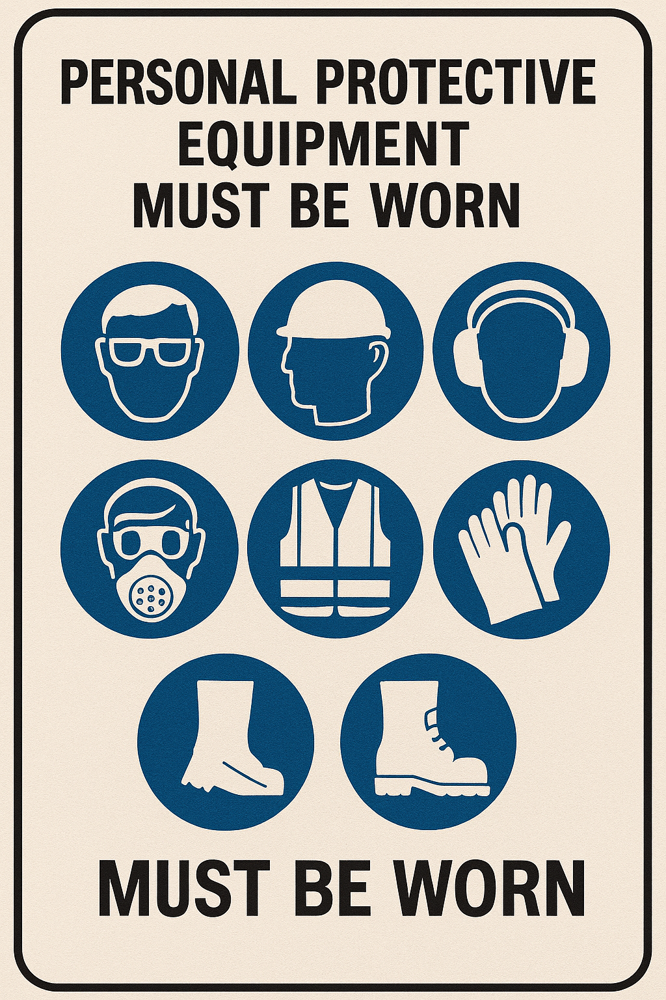
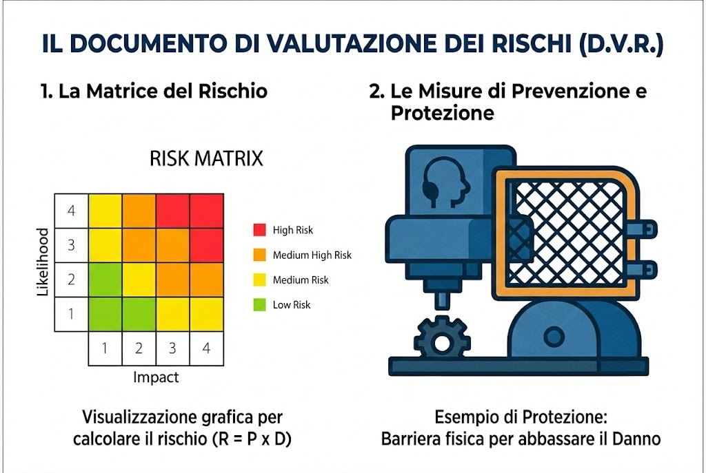

# 👷 Il Lavoratore

?> **DEFINIZIONE:**
Persona che svolge un'attività lavorativa nell'ambito dell'organizzazione di un datore di lavoro.

---

## ✅ Obblighi (Art. 20)

* **Prendersi cura della propria salute**.
* **Utilizzare correttamente i DPI** (Dispositivi Protezione Individuale).
* **Non rimuovere le protezioni** di sicurezza.
* **Segnalare le deficienze** dei mezzi.

---

### 🖼️ Esempi Visivi: Riconoscere i Doveri

È fondamentale saper leggere la segnaletica e capire la differenza tra una macchina sicura e una pericolosa.

| DPI Obbligatori (Cartellonistica) | Protezione Macchine (Prima e Dopo) |
| :---: | :---: |
|  **Segnaletica di Sicurezza** *(I cartelli blu rotondi indicano un OBBLIGO: vanno rispettati tassativamente!)* |  **PRIMA: Situazione PERICOLOSA** *(Ingranaggi/Organi in movimento esposti)*  ⬇️ *Dopo la Valutazione dei Rischi* ⬇️   **DOPO: Situazione SICURA** *(Carter di protezione installato)* |

---

### 🎬 Animazione: Il Pericolo degli Organi in Movimento

Perché è vietato rimuovere i carter? Perché gli ingranaggi in movimento creano un rischio gravissimo di **impigliamento e schiacciamento**.

*(Animazione che mostra il movimento continuo e pericoloso degli organi meccanici)*

---

### 🎥 Video Didattico: Caccia ai Rischi (Napo)

Napo è il personaggio simbolo della sicurezza in Europa. In questo episodio ci insegna a **identificare i pericoli** prima che sia troppo tardi.

*(Clicca sull'immagine per aprire la risorsa interattiva INAIL/EU-OSHA)*

---

## 🚫 Sanzioni

!> **ATTENZIONE (Art. 59)**
Il lavoratore è punibile penalmente (Arresto o Ammenda) se non rispetta gli obblighi (es. non usa i DPI) o manomette la sicurezza (es. rimuove il carter mostrato sopra).

---
[🔙 Torna all'Organigramma](ud4.md)
