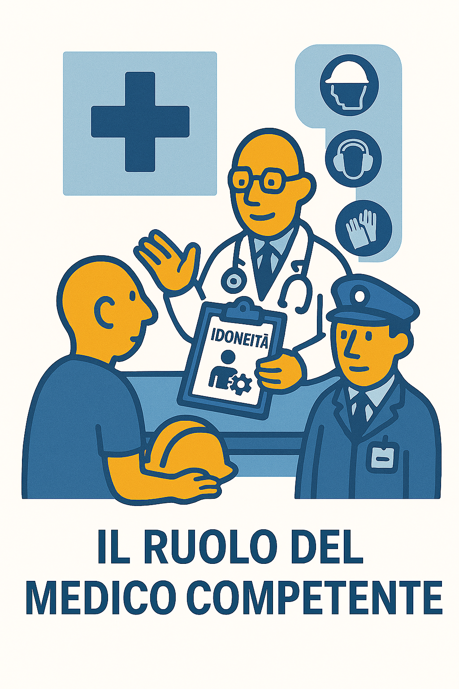

# 🩺 Il Medico Competente

?> **DEFINIZIONE (Art. 2):**
Medico in possesso di titoli e requisiti specifici che collabora con il datore di lavoro ai fini della valutazione dei rischi ed è nominato dallo stesso per effettuare la sorveglianza sanitaria.

---

### 📸 Il Ruolo in Sintesi

---

## 1. 🏥 Il Ruolo: "Sorveglianza Sanitaria"

Non è il medico di famiglia e non è il medico del Pronto Soccorso. È uno **specialista in Medicina del Lavoro**.
Il suo compito è verificare che l'attività lavorativa non stia danneggiando la salute del dipendente nel tempo.

---

## 2. 📋 Compiti Principali (Art. 25)

* **🤝 Collaborazione:** Aiuta il Datore e l'RSPP a scrivere il DVR (valuta stress, rischi chimici, posture, movimentazione carichi, ecc.).
* **🔍 Sopralluogo:** Deve visitare gli ambienti di lavoro almeno una volta all'anno per vedere i rischi "dal vivo".
* **📁 Cartella Sanitaria:** Custodisce i documenti medici personali dei lavoratori, coperti da **segreto professionale** (nessuno in azienda può leggerli, nemmeno il Datore).

---

## 3. 🚦 Le Visite e il Giudizio di Idoneità

Al termine della visita, il Medico deve emettere uno di questi 4 giudizi:

1.  ✅ **IDONEO:**
    Può svolgere la mansione senza problemi.
2.  ⚠️ **IDONEO CON PRESCRIZIONI:**
    Può lavorare ma con limitazioni (es. *"non sollevare pesi > 10kg"* o *"divieto lavoro notturno"*).
3.  ⏳ **NON IDONEO TEMPORANEO:**
    Ha un problema di salute momentaneo. Deve curarsi, poi sarà rivisitato (es. tra 3 mesi).
4.  🚫 **NON IDONEO PERMANENTE:**
    Non può più svolgere quella specifica mansione (per tutelare la sua salute).

---
[🔙 Torna all'Organigramma](ud4.md)
