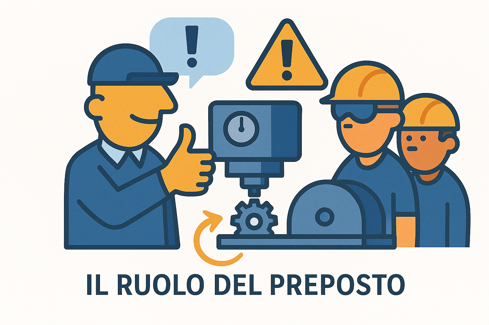

# 👷‍♂️ Il Preposto

?> **DEFINIZIONE:**
Persona che sovrintende alla attività lavorativa e garantisce l'attuazione delle direttive ricevute.

---

### 📸 Il Ruolo in Sintesi

---

## 👁️ Compiti e Poteri (Art. 19)

Nella pratica, il Preposto corrisponde spesso al **Capo Reparto** o **Capo Squadra**. È la figura operativa che sta a contatto diretto con i lavoratori.

I suoi compiti principali sono:

* **VIGILARE (Controllare):** Verificare costantemente che i lavoratori usino i DPI (caschi, guanti, ecc.) e rispettino le procedure di sicurezza.
* **INTERROMPERE IL LAVORO:** Ha il potere e il dovere di fermare subito l'attività se riscontra un **pericolo grave e immediato**.
* **SEGNALARE:** Deve comunicare tempestivamente al Datore di Lavoro le deficienze dei mezzi o le situazioni di rischio.

---

## 🚫 Responsabilità

!> **ATTENZIONE:**
Il Preposto ha una **responsabilità di vigilanza**. Se vede un lavoratore commettere un'imprudenza e *non interviene* (non lo richiama), il Preposto può essere ritenuto responsabile penalmente dell'eventuale infortunio ("Culpa in vigilando").

 
 

---
[🔙 Torna all'Organigramma](ud4.md)
