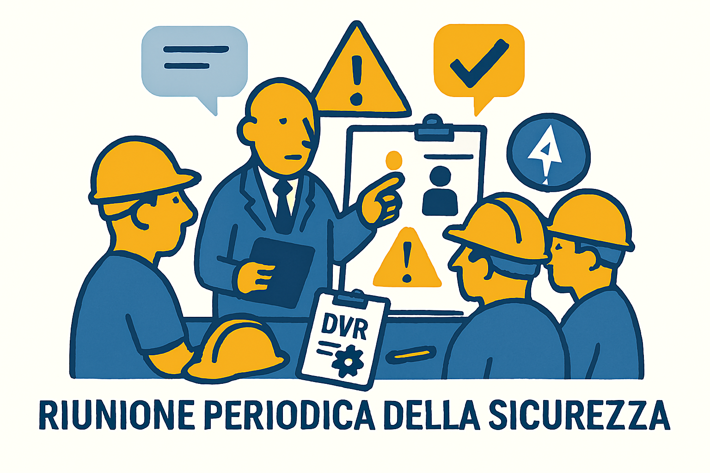

# 🤝 La Riunione Periodica della Sicurezza (Art. 35)

> **Obbligo di Legge:** Nelle aziende con **più di 15 lavoratori**, è obbligatorio tenere questa riunione almeno una volta all'anno.

## 1. Chi deve partecipare per forza?
Se manca anche solo uno di questi soggetti, la riunione non è valida:

1.  🕴️ **Il Datore di Lavoro** (o un suo rappresentante decisionale).
2.  📐 **L'R.S.P.P.** (Responsabile del Servizio di Prevenzione).
3.  🩺 **Il Medico Competente** (Se nominato).
4.  🗣️ **L'R.L.S.** (Rappresentante dei Lavoratori).

## 2. Di cosa si parla?
Non è una chiacchierata informale, si devono verbalizzare questi punti:

* Analisi del **DVR** (Documento Valutazione Rischi): va aggiornato?
* Andamento degli **infortuni** e delle malattie professionali avvenuti nell'anno.
* Scelta dei **DPI** (dispositivi di protezione, es. scarpe, caschi).
* Programmazione della **formazione** per l'anno successivo.
