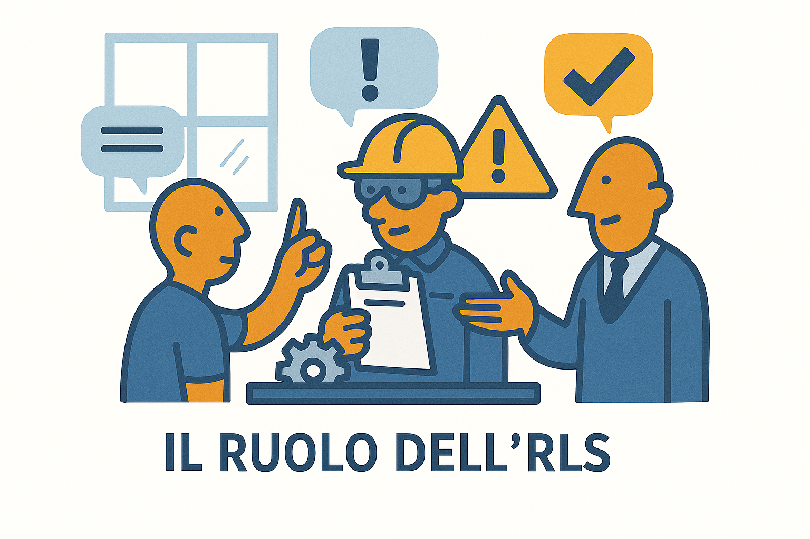

# 🗣️ L'R.L.S.

?> **DEFINIZIONE (Art. 2):**
**Rappresentante dei Lavoratori per la Sicurezza.**
Persona eletta o designata per rappresentare i lavoratori per quanto concerne gli aspetti della salute e della sicurezza durante il lavoro.

---

### 📸 Il Ruolo in Sintesi

---

## 1. Chi è? (La voce dei lavoratori)

È un **collega eletto** dagli altri lavoratori. Non è un "poliziotto", ma un garante.
Il suo ruolo è fare da **"ponte"** tra chi lavora e chi decide (Datore di Lavoro/RSPP).

> **Nota Importante:** L'RLS non può subire pregiudizio a causa dello svolgimento della sua attività (è protetto legalmente come un sindacalista).

---

## 2. ✅ Diritti e Compiti (Art. 50)

L'RLS ha diritti speciali ("attribuzioni") che gli altri lavoratori non hanno:

* **🗝️ Accesso:** Può accedere liberamente a tutti i locali aziendali per controllare.
* **🗣️ Consultazione:** Deve essere consultato *prima* che il Datore firmi il DVR o nomini l'RSPP.
* **📄 Documentazione:** Ha diritto di ricevere copia del Documento di Valutazione dei Rischi (DVR).
* **📣 Ricorso:** Se ritiene che le misure non siano idonee, può fare ricorso alle autorità competenti (ASL/Ispettorato).

---

## 3. 🛡️ Responsabilità

?> **PUNTO FONDAMENTALE:**
L'RLS **NON ha responsabilità penali** sulla sicurezza (a differenza del Preposto o del Datore di Lavoro).
Se c'è un incidente, la colpa non è mai dell'RLS, perché il suo ruolo è solo consultivo e di controllo, non decisionale.

 
 

---
[🔙 Torna all'Organigramma](ud4.md)
